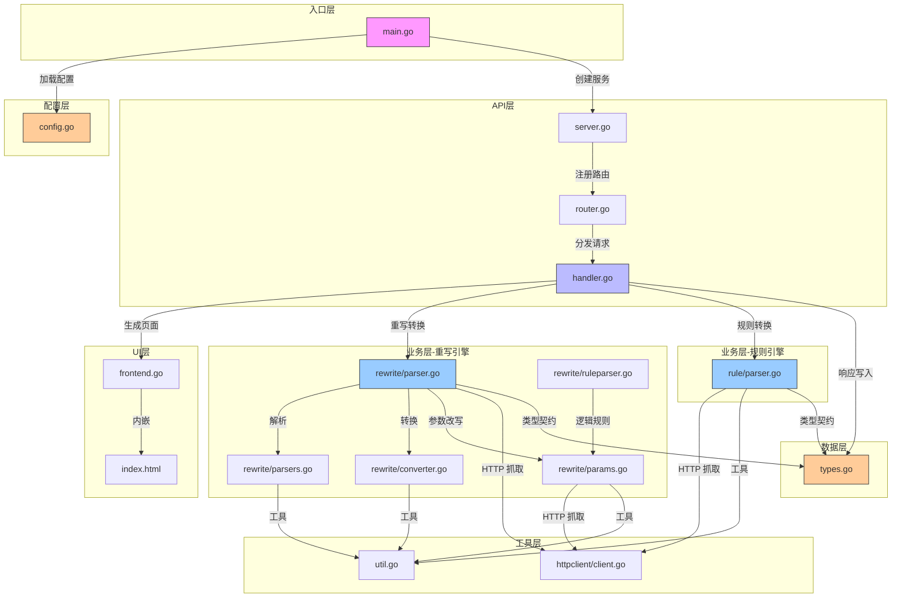

# 项目全局索引

## 项目概览
Script Hub（Go 重写版）是一个代理规则与脚本转换服务，完整还原原始 Node.js 版本的全部功能。
核心能力是将 QX 重写 / Surge 模块 / Loon 插件 / 规则集在各代理平台（Surge、Shadowrocket、Loon、Stash）之间互相转换。
后端使用 Go + chi 路由器，内嵌 HTML 前端页面，可直接部署为单二进制 HTTP 服务。

## 架构说明
采用分层架构，职责由外向内递进：

- **入口层** (`main.go`): 程序启动、配置加载、HTTP 服务生命周期与信号处理
- **API 层** (`internal/server`): chi 路由器 + 全捕获后手动分发，handler.go 为业务协调中枢
- **UI 层** (`internal/frontend`): 通过 `//go:embed` 内嵌 HTML 转换页面，注入 baseURL 返回客户端
- **业务层** (`internal/rewrite` + `internal/rule`): 两条独立的「解析 → 中间表示 → 转换」管线
  - `rewrite/` — 重写规则转换（QX/Surge/Loon → Surge/Shadowrocket/Loon/Stash）
  - `rule/` — 规则集转换（通用规则 → 各平台格式/域名集）
- **工具层** (`internal/httpclient` + `internal/util`): HTTP 请求封装、布尔/参数/查询解析工具
- **配置层** (`internal/config`): 环境变量配置加载 + 平台/格式常量枚举
- **数据层** (`internal/types`): 跨模块共享的 ResponseData / ResponseWriter 接口

## 目录结构

### main.go
- **地位**: 程序入口
- **功能**: 加载配置、创建 HTTP 服务、优雅关闭
- [详见 FOLDER_INDEX.md](FOLDER_INDEX.md)

### internal/config
- **地位**: 配置层
- **功能**: 环境变量配置 + 平台/目标格式/来源格式常量
- **核心文件**: config.go
- [详见 FOLDER_INDEX.md](internal/config/FOLDER_INDEX.md)

### internal/frontend
- **地位**: UI 层
- **功能**: 内嵌 HTML 转换页面，注入 baseURL
- **核心文件**: frontend.go, index.html
- [详见 FOLDER_INDEX.md](internal/frontend/FOLDER_INDEX.md)

### internal/httpclient
- **地位**: 工具层
- **功能**: 带超时、自定义头、gzip 解压的统一 HTTP 客户端
- **核心文件**: client.go
- [详见 FOLDER_INDEX.md](internal/httpclient/FOLDER_INDEX.md)

### internal/rewrite
- **地位**: 业务层 — 重写转换引擎
- **功能**: QX/Surge/Loon 重写规则的多格式解析、参数改写、目标平台转换
- **核心文件**: parser.go（入口+类型）, parsers.go（来源解析）, converter.go（目标转换）, params.go（参数改写）, ruleparser.go（逻辑规则）
- [详见 FOLDER_INDEX.md](internal/rewrite/FOLDER_INDEX.md)

### internal/rule
- **地位**: 业务层 — 规则集转换引擎
- **功能**: 通用规则集解析、跨平台格式化（Surge/Loon/Stash/域名集）
- **核心文件**: parser.go
- [详见 FOLDER_INDEX.md](internal/rule/FOLDER_INDEX.md)

### internal/server
- **地位**: API 层
- **功能**: HTTP 服务结构、URL 路由分发、请求处理器（协调 frontend/rewrite/rule）
- **核心文件**: server.go, router.go, handler.go
- [详见 FOLDER_INDEX.md](internal/server/FOLDER_INDEX.md)

### internal/types
- **地位**: 数据层
- **功能**: ResponseData 结构体与 ResponseWriter 接口（跨模块共享类型契约）
- **核心文件**: types.go
- [详见 FOLDER_INDEX.md](internal/types/FOLDER_INDEX.md)

### internal/util
- **地位**: 工具层
- **功能**: IsTrue / GetArgArr / ParseQueryString 等共享纯函数
- **核心文件**: util.go
- [详见 FOLDER_INDEX.md](internal/util/FOLDER_INDEX.md)

## 依赖关系图



## 核心流程

### 重写转换流程
1. 客户端请求 `/file/_start_/{encoded_url}/_end_/?type={source_type}&target={target_app}`
2. router.go → dispatchHandler → fileHandler → rewriteParserHandler
3. handler.go 构建 ParseInput（URLs / SourceType / TargetApp / Arguments）
4. rewrite/parser.go → HTTP 抓取远程内容 → 按 SourceType 分发解析器
5. rewrite/parsers.go 解析为 ParsedModule 中间表示（含 rewrites / scripts / MITM / rules / panels / hosts）
6. rewrite/params.go 应用参数修改（arg / njsname / timeout / engine / cron / MITM / policy / sni / pm / icon / dedup）
7. rewrite/converter.go 转换为目标格式输出
8. handler.go → writeResponse → 替换 script.hub URL → 返回 HTTP 响应

### 规则集转换流程
1. 客户端请求 `/file/_start_/{encoded_url}/_end_/?type=rule-set&target={target_app}`
2. router.go → fileHandler → ruleParserHandler
3. handler.go 构建 ParseInput（自动从 UA 推断 target）
4. rule/parser.go → HTTP 抓取 → 预处理（去注释、前缀展开、域名检测）→ 解析为 ruleLine
5. 按目标平台格式化（Surge / Loon / Stash / 域名集）并输出
6. handler.go → writeResponse → 返回 HTTP 响应

## 技术栈

- **语言**: Go 1.22+
- **HTTP 路由**: github.com/go-chi/chi/v5
- **前端**: 内嵌 HTML（//go:embed）
- **部署**: 单二进制，默认 0.0.0.0:9100

## 环境变量配置

| 变量 | 说明 | 默认值 |
|------|------|--------|
| `PORT` | 监听端口 | `9100` |
| `HOST` | 监听地址 | `0.0.0.0` |
| `HTTP_TIMEOUT` | HTTP 请求超时（秒） | `20` |
| `PARSER_BODY_MAX` | 最大响应体（KB） | `600` |

## 快速开始

```bash
# 直接运行
go run main.go

# 或编译后运行
go build -o script-hub .
./script-hub

# 指定端口
PORT=8080 go run main.go
```

---
⚠️ **自指声明**: 任何功能、架构、写法更新必须在工作结束后更新此文档
